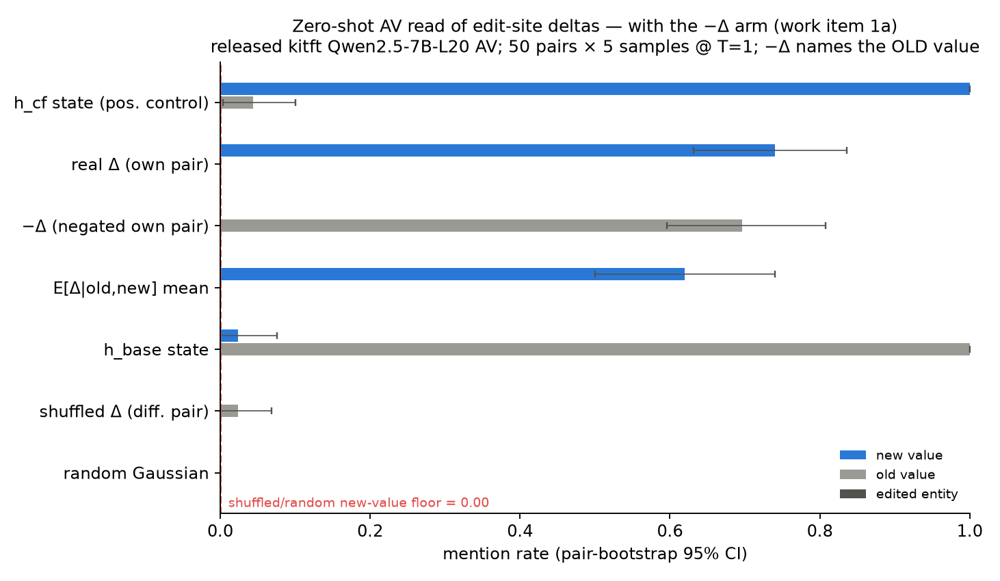
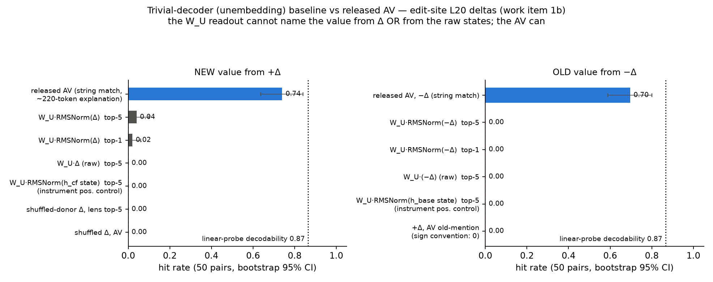
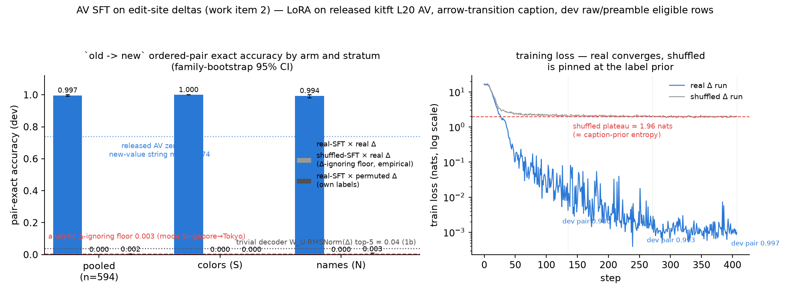

# Working-session summary — −Δ arm, trivial-decoder baseline, AV SFT

**Date:** 2026-07-19 · **Branch:** `counterfactual_nla_v2` · **Session brief:** −Δ arm → trivial-decoder baseline → transition SFT (work items 0–2).
All predictions were registered in writing before each run:
[`2026-07-19_negdelta_logitlens_predictions.md`](./2026-07-19_negdelta_logitlens_predictions.md) (1a+1b),
[`2026-07-19_sft_predictions.md`](./2026-07-19_sft_predictions.md) (SFT).
Full reports: [1a](./2026-07-19_negdelta_av_report.md) · [1b](./2026-07-19_trivial_decoder_report.md) · [SFT](./2026-07-19_sft_transition_report.md).

---

## Headline results

| # | Question | Answer | Key numbers |
|---|---|---|---|
| 1a | Is the AV's 0.74-new / 0.00-old asymmetry a sign convention? | **Yes** | −Δ names old **0.696** [0.58, 0.80], new **0.000**; paired diff vs real arm −0.04 [−0.18, +0.09] |
| 1b | Does a logit-lens (`W_U`) readout match the AV's 0.74? | **No — not even close** | lens top-5 **0.04** best convention; **states fail too** (value rank ~15k/152k); AV ≫ lens branch of the registered rule fires |
| 2 | Can a LoRA'd released AV emit `old -> new` from the edit-site Δ? | **Yes, at ceiling** | pair-exact **0.997** [0.992, 1.0]; shuffled-Δ control **0.000**; unseen transitions of seen values **0.993** |

**Plots** (each drawn with its trivial baseline / floor on the same axes):

- 
  `research/plots/2026-07-19_negdelta_av_mention_rates.png` — all seven zero-shot arms; −Δ (gray bar) mirrors real Δ (blue) with roles swapped.
- 
  `research/plots/2026-07-19_trivial_decoder_vs_av.png` — AV vs unembedding readout, both directions, with probe ceiling and floors.
- 
  `research/plots/2026-07-19_sft_transition_accuracy.png` — SFT accuracy by arm × stratum + loss curves (real converges to ~0.001; shuffled pinned at prior entropy ~1.95).

## 1a — −Δ through the zero-shot AV (5 samples × 50 pairs, same manifest/rule/seed)

- Pre-registered data fact that sharpened the prediction: **every REVERSE pair is
  the exact prompt swap of its TARGET partner** (200/200 verified) ⇒ −Δ is
  bitwise a real Δ of the partner row ⇒ "sign convention" was heavily favored
  a priori — and observed. Strata mirror the real arm (S 0.854 / N 0.525 vs
  0.892 / 0.575).
- Reading: the AV names whichever token identity sits in the **positive**
  direction; the old endpoint lives in the negative component. Both endpoints
  are AV-accessible, one per sign.
- SFT consequence: teaching `old -> new` = teaching a bidirectional read of an
  already-decodable code, not creating a new decodable quantity.

## 1b — trivial-decoder baseline (the gap the zero-shot report left open)

- `W_U·RMSNorm(Δ)` top-5 new-value: **0.04**; raw `W_U·Δ`: **0.00**; −Δ→old:
  **0.00**. **Instrument controls: the raw states also fail** (h_cf→new median
  rank 15,022; h_base→old 24,059) — the unembedding cannot read token identity
  at this site/layer at all. Top-5 decodes are noise tokens ("ysqli", "℠", …).
- With the earlier input-embedding retrieval null (EXP-2): the value code at
  edit-site L20 is in **neither weight-derived basis**. Only trained readers
  decode it: probe 0.96/0.87, AV 0.74, lens 0.04, floor 0.00.
- **Registered decision rule outcome: AV ≫ logit lens** — the first result in
  the arc a trivial baseline fails to reproduce. The "logit-lens-like" phrasing
  in the zero-shot report is retired. NOT established: AV > trained probe
  (it isn't: 0.74 < 0.87–0.96); any upgrade beyond token identity.

## 2 — AV SFT (LoRA r=64 α=128, lr 2e-5, 3 epochs, frozen before running)

- **Data:** 4,348 eligible train raw/preamble change rows (72.5% of 6,000;
  train screen run this session — it never existed; stratum split N 99.6% /
  S 54.4% matches frozen dev). Eval: 594 frozen-eligible dev rows, families
  fully disjoint from train, greedy decode, strict fullmatch parse.
  **`test_value` untouched.**
- **real-SFT × real Δ: pair-exact 0.997 [0.992, 1.0]** (S 1.000 / N 0.994;
  old-field 0.997 — vs 0.00 zero-shot; parse 1.000; the only 2 errors are one
  semantic pair).
- **46.5% of dev rows have a train-unseen ordered transition → 0.993 on those.**
  The mapping composes per endpoint; the lookup bound moves from the (old,new)
  pair down to the individual value.
- **shuffled-Δ-trained control × real Δ: 0.000** (analytic Δ-ignoring floor
  0.003; greedy collapses to one caption, 583/594; loss pinned at ~1.95 nats).
- **real-SFT × permuted Δ: own labels 0.002, donor labels 0.997** — the model
  reads exactly the injected vector.
- Registered gate analog: real − shuffled = **+0.997** (≫ 40pp).
- **Caps that stand:** seen values only; deterministic template ⇒ value-level
  lookup (Amendment 1 §10, cruxes §C3); consequence/NO_CHANGE deliberately
  excluded (site is behaviorally blind); one cell of the format×init 2×2 —
  **Stage C is not marked passed**.
- Calibration miss owned: predicted pair-exact 0.82 [0.65, 0.92]; observed
  0.997 — second consecutive under-prediction of token-identity readability.

## Work item 0 + housekeeping

- Part 0 standing instructions registered verbatim:
  `research/docs/STANDING_INSTRUCTIONS.md`, item 0 of the `research/CLAUDE.md`
  read order.
- **The Qwen3-8B retrospective is still absent from this instance** (searched
  repo / home / scratchpad / filesystem) — import and the §11.2 provenance
  entry remain blocked until re-shared. Sixth absence flag.
- Environment: fresh H100 80GB, torch 2.12.0+cu130 (prior: 2.7.0+cu128; dev
  screen agreement across versions 0.9925), transformers 5.14.1 pinned,
  pytest 65 passed / 1 skipped, pinned tokenizer re-fetched. **No volume on
  this instance** (`workspace_is_volume: false`): a recycle/destroy loses
  everything local, including the two saved LoRA adapters (adapters + large
  activation caches are gitignored as regenerable; regeneration = one script
  run each).

## Addendum (same day): test_value spent — the reader generalizes

With user sign-off, the registered single-spend `test_value` eval ran
([predictions](./2026-07-19_testvalue_predictions.md) ·
[report](./2026-07-19_testvalue_reader_report.md) ·
plot `../plots/2026-07-19_testvalue_reader.png`). Outcome: **the SFT'd AV names
held-out values it never emitted in training** — seen→held pair-exact 1.000,
held→seen 0.878 [0.74, 0.98], held-side field accuracy 0.939 strict / 0.963
case-insensitive; every miss is a surface-form garble of the correct word
("Charcoal", "crem"), never a nearest-color substitution; zero-shot reference
reads held values normally (0.941); permuted-Δ floor 0.000. Combined with
EXP-2's 1-NN, the value code is general at both representation and reader
level (S stratum, this site/model). No vocabulary collapse.

## Recommended next (user decision)

1. ~~`test_value` eval~~ — **done** (see addendum); the split is now spent for
   reader-level questions.
2. **Derived-relation mini-set (Extension C)** — now unambiguously the
   frontier: the only remaining axis where the channel could be more than a
   token-identity code (separates consequence-reading from token-naming).
3. Retrospective import (~15 min) once the file is shared.
